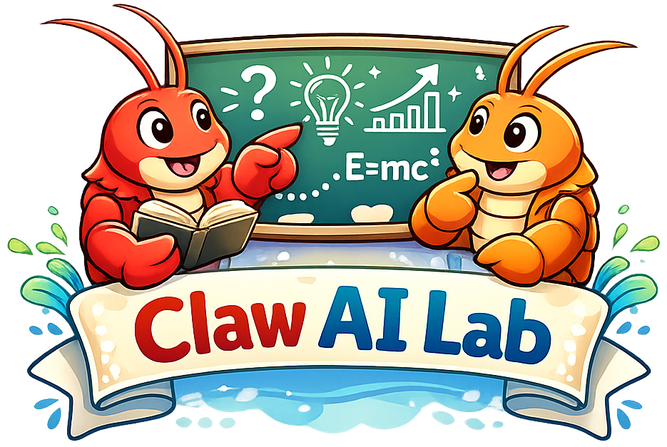
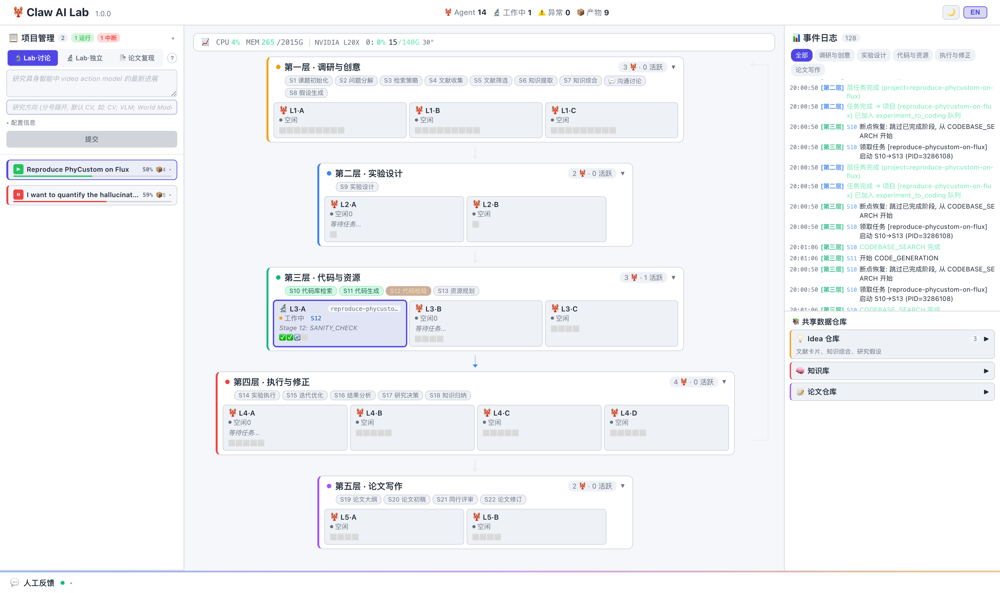

<p align="center">
  
</p>

<h2 align="center"><b>Autonomous Multi-Agent Research Team</b></h2>

<!-- <p align="center">
  <b><i>One Command. A Complete Team.</i></b>
</p> -->

<p align="center">
  <a href="https://clawailab.ai"></a>
  <a href="LICENSE"></a>
  <a href="https://python.org"></a>
  <a href="https://nodejs.org"></a>
  <a href="https://github.com/Claw-AI-Lab/Claw-AI-Lab"></a>
</p>

---

## 🔥 Updates

- __[2026.04.02]__: We released Preview v1.1.0 powered by **claw-code harness**.
- __[2026.03.25]__: We released Preview v1.0.0.

---

<!-- <div align="center">
  <video src="https://github.com/user-attachments/assets/6660e4eb-f2a8-4c39-b47e-cbaf753eca7b" controls width="100%"></video>
</div> -->

## 🤔 What Is This?

**Claw AI Lab** is a lab-native multi-agent research platform for interactive and scalable AI-driven science. It enables users to create a full AI research lab from a single prompt, with customizable roles, research directions, and collaborative workflows, rather than relying on a single-agent or fixed serial pipeline. Claw orchestrates multiple agents and projects in parallel through a FIFO-based scheduling framework, maximizing compute utilization while supporting cross-project knowledge sharing and mutual improvement. Crucially, the system keeps humans in the loop: users can intervene whenever needed, provide feedback under ambiguity, inject new ideas, and iteratively refine the research process through rollback and continuation. Combined with a simple UI that reduces everything to prompts and clicks, Claw transforms automated research into a more intuitive, steerable, and laboratory-like experience.

**We welcome contributions from the community to make this project better together! 
You’re also warmly invited to scroll to the bottom of the page to join our group for beta testing and discussion.**

---

## ✨ Key Features

<table>
<tr><td>🖥️</td><td><b>Interactive UI</b></td><td>Real-time web dashboard with event stream, data shelf, and multi-project monitoring</td></tr>
<tr><td>🧬</td><td><b>Claw Code Harness</b></td><td>Reads your local codebases, datasets &amp; checkpoints — writes runnable code back to disk</td></tr>
<tr><td>⚡</td><td><b>GPU &amp; NPU Ready</b></td><td>Dynamic scheduling across CUDA and Ascend NPU hardware</td></tr>
<tr><td>🔬</td><td><b>End-to-End Pipeline</b></td><td>One prompt → paper + code + figures + experiment logs, fully autonomous</td></tr>
<tr><td>🤝</td><td><b>Three Research Modes</b></td><td><b>Explore</b> · <b>Discussion</b> (multi-agent debate) · <b>Reproduce</b></td></tr>
<!-- <tr><td>📄</td><td><b>PDF Reference Upload</b></td><td>Upload reference papers as PDF — the system extracts and cites them automatically</td></tr> -->
</table>

---

### 🏆 Generated Project Showcase

Each project autonomously produces a full research deliverable: **Paper** · **Code** · **Figures** · **Experiment Logs**

<table width="100%">
<tr>
<td align="center" width="50%"><a href="assets/showcase/showcase-quantify-hallucination.md"><b>Quantifying Video Hallucination</b></a><br><sub>Lab Explore · CV · Video Generation Evaluation</sub></td>
<td align="center" width="50%"><a href="assets/showcase/showcase-reproduce-phycustom-on-flux.md"><b>Reproducing PhyCustom on FLUX</b></a><br><sub>Reproduce · Image Gen · Customization</sub></td>
</tr>
</table>

---

### 🏆 Discussion Mode Showcase

Multi-agent discussion on: **"What is the most deployable direction for Video Action Models in Embodied AI?"**

> **Agent A** — World Model + MPC (Model Predictive Control) is the most industrially stable path.
>
> **Agent B** — "Train with video, infer with action" is the most deployable policy paradigm.
>
> **Agent C** — Execution monitoring & SOP (Standard Operating Procedure) automation lands fastest as a product.

**Consensus:** The most deployable form is not a single end-to-end model, but a **layered, modular system** — use video supervision during training to learn rich dynamics, output actions directly at inference for low latency, and layer planning/MPC/safety modules on top for closed-loop robustness and recovery.

<details open>
<summary><b>Top 3 Research Directions (ranked by deployability)</b></summary>

| # | Direction | Deployability |
| :---: | :--- | :--- |
| 1 | **Layered Video-Action Stack** — video-action joint training + direct action inference + MPC safety | Highest — best balance of latency, interpretability & safety |
| 2 | **Video-to-Plan / SOP** — demo videos → step sequences & skill graphs for existing robots | High — smallest embodiment gap, clearest commercial path |
| 3 | **Execution Monitor** — real-time step tracking, anomaly detection, re-planning triggers | High — fastest to production; critical for industrial reliability |

</details>

<details open>
<summary><b>Key Contradictions Resolved</b></summary>

| Debate | Resolution |
| :--- | :--- |
| World Model + MPC vs. Direct Action? | **Combine both** — world model for representation, direct action for control, MPC for safety |
| Human video: valuable or too much gap? | **Pre-training yes**; direct low-level transfer not yet reliable |
| Is monitoring a "real" action model? | Not the backbone, but **fastest to reach production value** |

</details>

**[→ Full Transcript](assets/showcase/discussion_transcript.md)** · **[→ Consensus Synthesis](assets/showcase/consensus_synthesis.md)**

---

## 🚀 Quick Start

### 1. Install

```bash
git clone https://github.com/Claw-AI-Lab/Claw-AI-Lab.git
cd Claw-AI-Lab

# Create python environment
conda create -n clawailab python=3.11
conda activate clawailab

# Backend
cd backend/agent
pip install -e ".[all]"
pip install websockets

# Frontend
cd ../../frontend
npm install
cd ..

# ML dependencies
# You can add more packages based on your research project
pip install torch torchvision diffusers transformers accelerate safetensors datasets \
            huggingface_hub opencv-python pandas matplotlib scikit-image scipy einops tqdm
```

### 2. Configure

Fill in following configurations in examples/config_template.yaml:
```
llm:
  provider: "openai-compatible"
  api_key: "your-api-key"
  primary_model: "gpt-5.4"
  coding_model: "claude-opus-4-6"
  image_model: "gemini-3-pro-image-preview"
  fallback_models:
    - "gpt-4o"

sandbox:
  python_path: "/path/to/your/python3"
```

Thanks a lot for [KOKONI's](https://www.kokoni3d.com/) support for this project, and api_key can be obtained [here](http://www.longcatcloud.com/).

### 3. Run

```bash
./start.sh              # Start all services
./start.sh stop         # Stop
./start.sh restart      # Restart
./start.sh status       # Status check
./start.sh fresh        # Clean restart (reset all data)
```

Open **http://localhost:5903/** → Submit your research topic and let the agents work.

#### Web UI Preview

<p align="center">
  
  <br/>
  <sub>Claw AI Lab web interface for launching and monitoring research runs</sub>
</p>

---

## 💡 Tips to Get the Best Results

| # | Recommendation | Why |
|---|---|---|
| 1 | **Prepare local codebases, datasets & checkpoints** — enter their paths when submitting a project | Avoids download delays and network failures during runs |
| 2 | **Use a strong coding model like Claude Opus 4.6** | Significantly better code quality and fewer iteration cycles |
| 3 | **Review the `IMPORTANT` fields in [Configuration Details](#️-configuration-details)** | Misconfigured keys or resource limits are the #1 cause of failed runs |

---

## ⚙️ Configuration Details

Description of each configuration in examples/config_template.yaml.
<details>
<summary>Click to expand</summary>

```yaml
# === Project ===
project:
  name: "my-project"              # Project identifier, used for directory naming and UI display
  mode: "full-auto"               # Pipeline mode: "full-auto" runs all stages without human gates

# === Research ===
research:
  topic: "Your research topic"    # The research topic or paper to reproduce (required)
  domains:                        # Research domains for literature search scope
    - "deep-learning"
  daily_paper_count: 5            # Number of papers to retrieve per search query
  quality_threshold: 3.0          # Minimum relevance score (1-5) for literature screening

# === Runtime ===
runtime:
  timezone: "Asia/Shanghai"       # Timezone for timestamps in logs and reports
  max_parallel_tasks: 1           # Max concurrent tasks per agent (keep 1 for stability)
  approval_timeout_hours: 1       # Timeout for human approval at gate stages
  retry_limit: 2                  # Number of retries on stage failure before giving up

# === Notifications ===
notifications:
  channel: "console"              # Notification channel: "console" | "discord" | "slack"
  target: ""                      # Channel target (e.g. Discord webhook URL, leave empty for console)
  on_stage_start: true            # Notify when a stage begins
  on_stage_fail: true             # Notify when a stage fails
  on_gate_required: true          # Notify when human approval is needed

# === Knowledge Base ===
knowledge_base:
  backend: "markdown"             # Storage format: "markdown" | "obsidian"
  root: "docs/kb"                 # Root directory for knowledge base files

# === OpenClaw Bridge ===
openclaw_bridge:
  use_cron: false                 # Enable scheduled research runs
  use_message: false              # Enable progress notifications via messaging platforms
  use_memory: false               # Enable cross-session knowledge persistence
  use_sessions_spawn: false       # Enable spawning parallel sub-sessions
  use_web_fetch: false            # Enable live web search during literature review
  use_browser: false              # Enable browser-based paper collection

# === LLM ===
llm:
  provider: "openai-compatible"   # LLM provider: "openai-compatible" | "openai" | "deepseek" | "acp"
  api_key: "sk-your-key"          # **IMPORTANT** API key (can also use api_key_env to read from environment)
  api_key_env: "RESEARCHCLAW_API_KEY"     # Environment variable name for API key (fallback if api_key is empty)
  primary_model: "gpt-5.4"       # **IMPORTANT** Main model for research, analysis, and writing stages
  coding_model: "claude-opus-4-6"        # **IMPORTANT** Model for code generation (S11). Leave empty to use primary_model
  image_model: "gemini-3-pro-image-preview"  # **IMPORTANT** Model for figure generation in paper writing (L5)
  fallback_models:                # Fallback model chain — used when primary model fails
    - "qwen3-max"
    - "qwen3.5-plus"
    - "qwen-max"
    - "qwen-plus"
    - "qwen2.5-72b-instruct"
  timeout_sec: 6000

# === Security ===
security:
  hitl_required_stages: []        # Stage numbers requiring human approval (e.g. [5, 9, 20])
  allow_publish_without_approval: true   # Allow paper export without human review
  redact_sensitive_logs: false    # Redact API keys and sensitive data in logs

# === Experiment ===
experiment:
  mode: "sandbox"                 # Execution mode: "sandbox" (local Python) | "docker" | "simulated"
  time_budget_sec: 6000           # **IMPORTANT** Max time budget per experiment run in seconds
  max_iterations: 3               # Number of iterative refinement cycles in S15 (Edit-Run-Eval loop)
  metric_key: "primary_metric"    # Name of the primary evaluation metric
  metric_direction: "minimize"    # Optimization direction: "minimize" | "maximize"
  datasets_dir: "/path/to/datasets"      # **IMPORTANT** Absolute path to datasets directory
  checkpoints_dir: "/path/to/checkpoints"  # **IMPORTANT** Absolute path to model weights directory
  codebases_dir: ""    # Absolute path to reference codebases directory
  shared_results_dir: "/path/to/shared_results"  # Directory for cross-project shared results
  paper_length: "short"           # Paper length: "short" (~4 pages) | "long" (~8 pages)

  # Sandbox execution environment
  sandbox:
    python_path: "/path/to/python3"  # **IMPORTANT** Python interpreter path for running experiments
    gpu_required: true            # Whether experiments require GPU
    gpus_per_project: 1           # Number of GPUs allocated per project
    max_memory_mb: 16384          # Max memory limit for experiment processes (MB)
    allowed_imports:              # Whitelist of allowed Python packages in sandbox
      - "numpy"
      - "torch"
      - "transformers"
      - "diffusers"
      # ... add packages as needed

  sanity_check_max_iterations: 18  # **IMPORTANT** Max fix attempts in S12 code testing. 0 = skip fixes, trigger intervention immediately

  # Legacy code agent (disabled by default, use opencode instead)
  code_agent:
    enabled: false

  # OpenHands Beast Mode — delegates complex code generation to OpenHands agent
  opencode:
    enabled: true                 # Master switch for Beast Mode
    auto: true                    # Auto-trigger based on complexity score (vs. manual)
    complexity_threshold: 0.2     # Complexity score threshold (0.0-1.0). Lower = more likely to use Beast Mode
    model: "claude-opus-4-6"      # **IMPORTANT** LLM model used by OpenHands agent
    timeout_sec: 2400             # Max time for Beast Mode code generation (seconds)
    max_retries: 1                # Number of retries if Beast Mode fails to produce main.py
    workspace_cleanup: false      # Whether to delete temporary workspace after completion

# === Prompts ===
prompts:
  custom_file: ""                 # Path to custom prompts YAML file (empty = use defaults)
```

</details>

<!-- ---

## Key Features


- **Multi-Agent Discussion** | Multiple agents with different LLMs debate and reach consensus, avoiding homogeneous outputs. |
- **Beast Mode Code Generation** | Complex experiments auto-routed to OpenHands for multi-file project generation. |
- **Dynamic GPU Allocation** | Automatically detects free GPUs based on utilization. No manual `CUDA_VISIBLE_DEVICES`. |
- **Checkpoint & Resume** | Auto-saves progress after each stage. Resume from any checkpoint after restart. |
- **Manual Intervention** | Auto-pauses on code test failures. Yellow ⚠ indicator on UI with detailed error info. |
- **Knowledge Loop** | Experiment results and insights feed back into the knowledge base for future projects. |
- **Real-time Monitoring** | Web UI with agent status, GPU metrics, task queues, and event logs. |
- **Paper with Figures** | Auto-generates experiment charts, renders concept figures, and injects them into the paper. | -->

---

## 🙏 Acknowledgement

We learned and reused code from the following projects: [AutoResearchClaw](https://github.com/aiming-lab/AutoResearchClaw), [AutoResearch](https://github.com/karpathy/autoresearch), [claw-code](https://github.com/ultraworkers/claw-code).

We thank the authors for their contributions to the community!

## 📄 License

MIT — see [LICENSE](LICENSE) for details.

## 📌 Citation

If you find Claw AI Lab useful, please cite:

```bibtex
@misc{wu2026clawailab,
  author       = {Wu, Fan and Chen, Cheng and Tan, Zhenshan and Zhang, Taiyu and
                  Gao, Dingcheng and Zhu, Lanyun and Zhu, Qi and Tan, Yi and Ji, Deyi and 
                  Lin, Guosheng and Chen, Tianrun and Ye, Deheng and Liu, Fayao},
  title        = {Claw AI Lab: An Autonomous Multi-Agent Research Team},
  year         = {2026},
  url          = {https://github.com/Claw-AI-Lab/Claw-AI-Lab},
  note         = {GitHub repository}
}
```

---

## 💬 Community

<p align="center">
  <br/>
</p>
