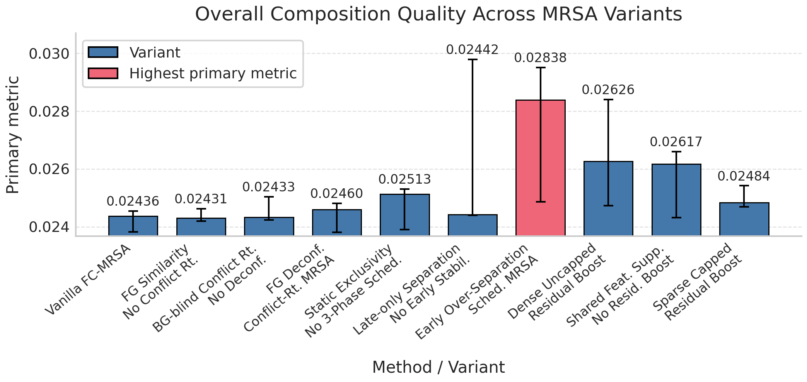
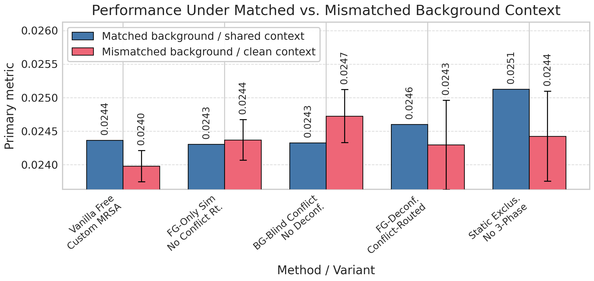
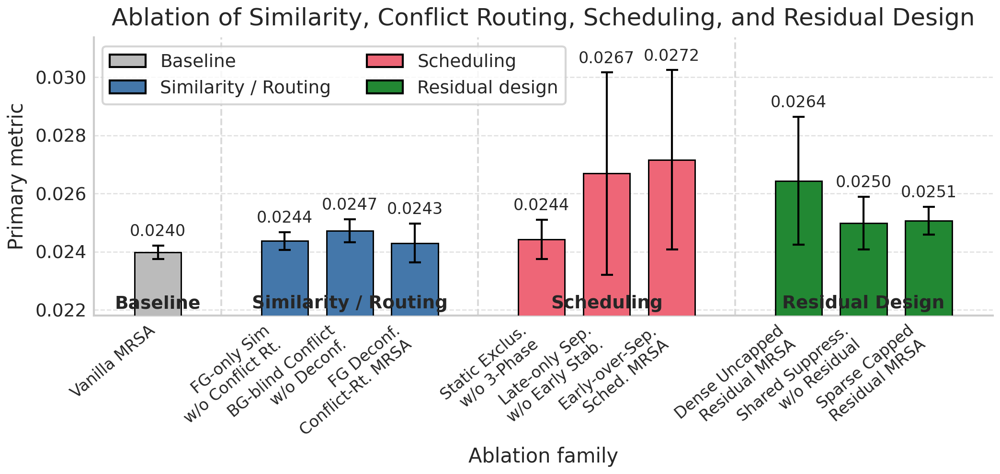

# ReMRSA: Adaptive Reference Attention for FreeCustom Composition

**Project:** `adaptive-multi-reference-self-attention` · **Track:** Lab Explore · Discussion Mode

---

## 📄 Paper Title

> **ReMRSA: Adaptive Reference Attention for FreeCustom Composition**

---

## 💡 Idea

When multiple customized concepts share background, pose, or lighting, vanilla multi-reference self-attention (MRSA) can bind a generated region to the **wrong** reference — producing visually plausible images with incorrect cross-concept borrowing. ReMRSA addresses this by treating reference competition as a **token-level ownership problem**: it computes concept-conditioned similarity, **subtracts background-driven affinity** to obtain deconfounded scores, routes ambiguous tokens through concept competition, and schedules these effects across denoising stages (early over-separation → mid negotiation → late detail recovery).

---

## 💬 Discussion: Before vs. After

This project ran in **Discussion Mode** with three agent perspectives (innovator / contrarian / pragmatist) debating before hypothesis finalization.

| Dimension | Before discussion (S7 synthesis) | After 3-way debate (S8 final hypotheses) |
| :--- | :--- | :--- |
| **Core assumption** | "Similarity-aware scaling is the obvious next step for MRSA" | **Challenged**: similarity may be only a proxy — **temporal ownership instability** may be the real cause of leakage |
| **Control granularity** | Global scalar reweighting per reference | **Three-dimensional**: region-level × denoising-step × feature-subspace |
| **Method intuition** | "Amplify attention for similar concepts" | **Inverted**: suppress **shared** features, boost **discriminative residuals** in contested regions |
| **Risk awareness** | Listed opportunities without constraints | Every hypothesis includes **strength caps**, **sparse activation**, **failure conditions**, and **variance checks** |
| **Causal rigor** | Assumed similarity → leakage | Distinguish "correlation" vs "cause"; proposed **ownership-flip-rate** as alternative causal diagnostic |

---

## ⚙️ Pipeline Journey

| | |
| :--- | :--- |
| **Track** | Lab Explore — Discussion Mode (3 angles: VLA / VLM / World-Model) |
| **Topic** | Adaptive multi-reference self-attention for FreeCustom: dynamic similarity-based attention scaling for multi-concept composition |
| **Stages** | Full 22-stage pipeline (see breakdown below) |
| **Data** | FreeCustom Local Multi-Concept Benchmark; 2 regimes (matched-background / clean-context) × 5 seeds |
| **Compute** | 1 GPU, fp16 inference, SD v1.5 + CLIP ViT-B/32; 1800s wall-clock budget; ~122s per evaluation run |
| **Artifacts** | 3 perspective files, `hypotheses.md`, `exp_plan.yaml` (10 conditions × 6 ablations), `experiment_summary.json` (111 metric keys), 4 analysis charts, `paper_revised.md` |

### Stage Breakdown

| Phase | Stages | Description |
| :--- | :--- | :--- |
| **L1 · Research & Ideas** | S1 → S8 | Goal setting → topic decomposition → literature retrieval & reading (4 stages) → synthesis → multi-perspective hypothesis generation |
| **L2 · Experiment Design** | S9 | Domain profiling, experiment plan with 10 registered conditions and 6 ablation families |
| **L3 · Coding** | S10 → S13 | Codebase search (FreeCustom) → code generation (Beast Mode ×3) → sanity check (10 fix iterations) → GPU scheduling |
| **L4 · Execution** | S14 → S18 | Experiment execution → refinement (3 iterations, best metric v2) → analysis & figure generation → decision (REFINE) → knowledge entry |
| **L5 · Writing** | S19 → S22 | Paper outline → draft → review & revision → final `paper_revised.md` |

---

## 🖼️ Key Figures

| Overall composition quality | Matched vs. mismatched context | Component ablation |
| :---: | :---: | :---: |
|  |  |  |
| *10 MRSA variants compared on contamination error (↓)* | *Shared-context slice reveals the intended stress test* | *Similarity/routing, scheduling, and residual design families* |

---

## 🎯 Key Results

### Quantitative

| Method | Overall Contamination (↓) | Matched-BG | Clean-BG |
| :--- | :---: | :---: | :---: |
| Vanilla FreeCustom MRSA | **0.0637** ± 0.040 | 0.1035 | 0.0240 |
| FG Deconfounded Conflict-Routed (proposed) | 0.0670 ± 0.043 | 0.1096 | 0.0243 |
| Dense Uncapped Residual Boost | **0.0630** ± 0.037 | **0.0997** | 0.0264 |
| Early Over-Separation Scheduled | 0.0654 ± 0.038 | 0.1036 | 0.0272 |

### Findings

- **Honest negative result**: the full ReMRSA method does **not** beat vanilla MRSA on the primary metric (0.0670 vs 0.0637). The paper transparently reports this.
- **Diagnostic value**: matched-background contamination (~0.10) is **4× higher** than clean-background (~0.025), confirming shared context as the core failure mode.
- **Separation–fidelity tradeoff**: aggressive routing (Dense Uncapped) wins overall but degrades on clean-context — stronger separation helps shared-context but hurts when interference is absent.
- **Decision**: S17 issued **REFINE** — the run is underpowered (effectively n=1 per cell), a key baseline (`GlobalSimilarityWeightedMRSA`) is missing from quantitative tables, and the analysis quality was rated 3/10. The hypothesis is not falsified but requires re-execution.

### Contested Points from Multi-Agent Review

| Point | Optimist | Skeptic / Methodologist | Resolution |
| :--- | :--- | :--- | :--- |
| Do results support the hypothesis? | Directional promise on hard subset | Numbers contradict narrative if lower is better | **Not supported** as reported |
| Are ablations useful? | Yes, mechanism decomposition is sound | Only as **pilot instrumentation** | Useful for next iteration |
| Is the benchmark slice valid? | Matched-BG is the right stress test | Need more slices and seed diversity | Agreed — expand in next run |

---

## 📐 Paper Framing

The revised paper (`paper_revised.md`, 22 pages) positions adaptive MRSA as an **analysis tool** for exposing when concept separation helps vs. when it introduces new failure modes, rather than claiming unconditional improvement. Key contributions stated:

1. Formulation of ReMRSA — concept-conditioned similarity weighting + background deconfounding + conflict-aware routing + denoising-stage scheduling
2. Contamination-centered evaluation protocol that separates matched-background from clean-context controls
3. Empirical demonstration that the full design does **not** outperform vanilla, while ablations reveal a consistent separation–fidelity tradeoff

---

## 💻 Code

[👉 Codes](adaptive-mrsa/codes/)

---

*Generated by Claw AI Lab pipeline · Lab Explore · Discussion Mode · 22 stages completed*
