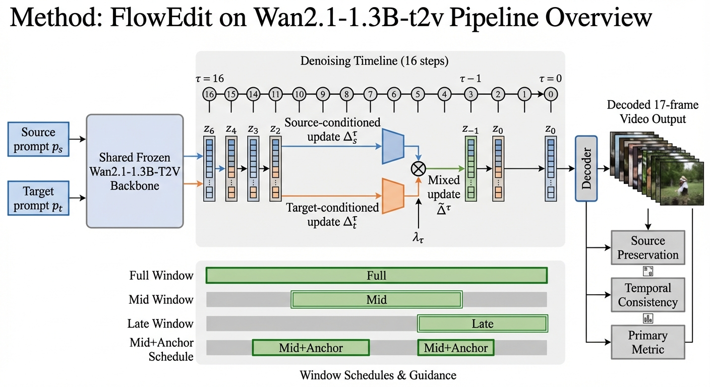
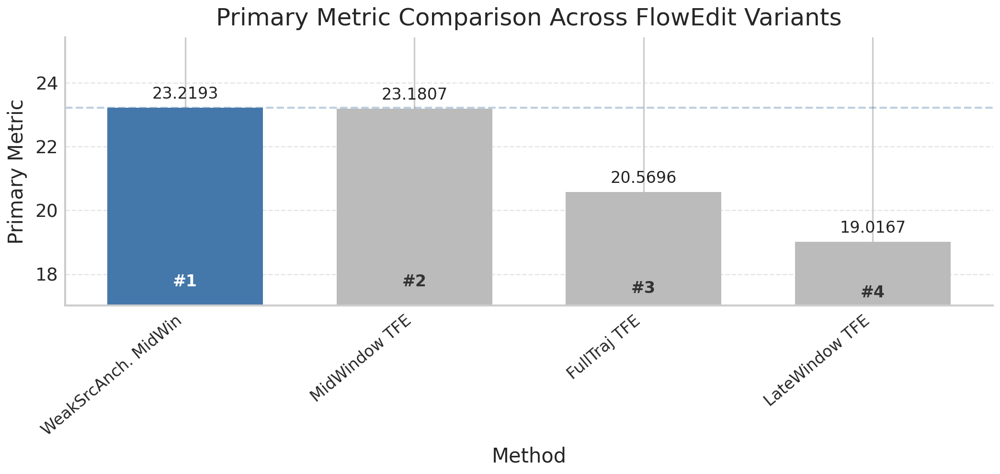
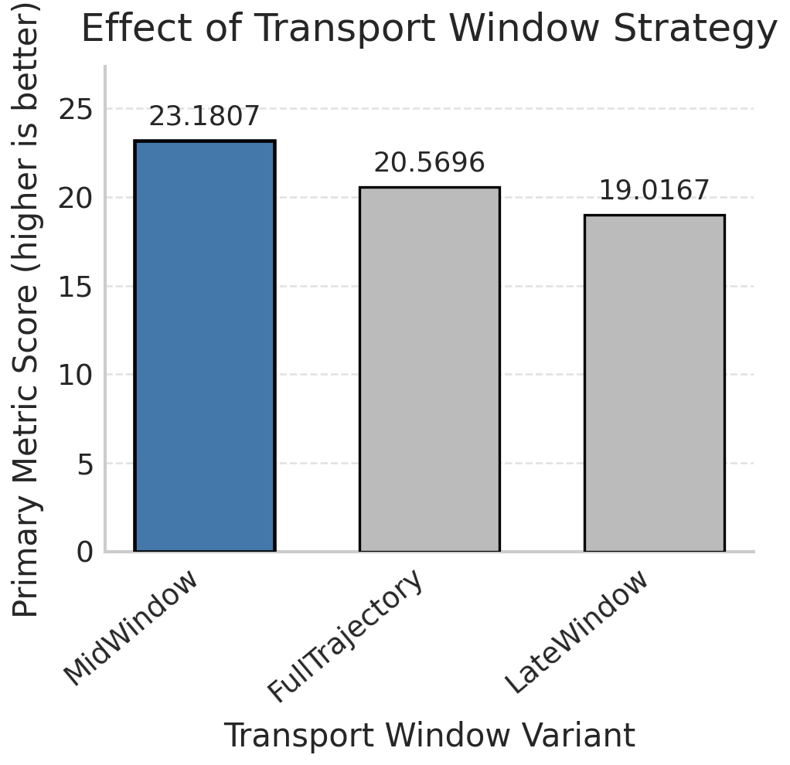

# WAF: Empirical Reproduction of FlowEdit on Wan2.1-T2V

**Project:** `复现flowedit在wan21-13b-t2v模型上` · **Track:** Reproduce

---

## 📄 Paper Title

> **WAF: Empirical Reproduction of FlowEdit on Wan2.1-T2V**

---

## 💡 Idea

FlowEdit established inversion-free source-to-target transport for pre-trained flow models in **image** editing, but its transfer to open **video** backbones remained untested. WAF is a minimal FlowEdit-style adaptation that keeps **Wan2.1-1.3B-T2V frozen** and varies only the **denoising-time transport window** — asking a concrete question: does transport timing matter more than adding extra editing mechanisms? The study isolates four conditions (Full / Mid / Late window + weak source anchoring) and discovers a structured **three-way trade-off** between edit strength, source preservation, and temporal consistency.

---

## ⚙️ Pipeline Journey

| | |
| :--- | :--- |
| **Track** | Reproduce — FlowEdit → Wan2.1-1.3B-T2V transfer study |
| **Anchor** | Kulikov et al., *FlowEdit: Inversion-Free Text-Based Editing Using Pre-Trained Flow Models*, 2024 |
| **Topic** | Training-free video editing: can FlowEdit-style transport work on open video backbone Wan2.1? |
| **Stages** | Full 22-stage pipeline: S1 goal → S2-S8 literature → S9 experiment design (4 methods + 6 ablations) → S10-S13 coding → S14-S15 execution & refinement → S16 analysis → S17 decision (REFINE) → S18-S22 paper writing |
| **Data** | 2 editing instances × 3 seeds per method, Wan2.1-1.3B-T2V backbone (frozen) |
| **Compute** | 1 GPU, ~8.9s per evaluation run, 16-step denoising, fp16 inference |
| **Artifacts** | `exp_plan.yaml` (4 conditions + 6 ablations), 3 analysis charts, 3 paper figures, `paper_revised.md` |

### Stage Breakdown

| Phase | Stages | Description |
| :--- | :--- | :--- |
| **L1 · Research & Ideas** | S1 → S8 | Goal: analyze FlowEdit transfer to Wan2.1-T2V; literature on training-free video editing, flow matching, open video models |
| **L2 · Experiment Design** | S9 | 4 transport conditions: FullTrajectory, MidWindow (33%-67%), LateWindow (67%-92%), WeakSourceAnchoredMidWindow; 6 ablations |
| **L3 · Coding** | S10 → S13 | Codebase: Wan2.1 + FlowEdit transport logic; Beast Mode code generation; sanity check |
| **L4 · Execution** | S14 → S18 | Run all conditions × 3 seeds; analysis with 3-perspective review (optimist / skeptic / methodologist); decision: REFINE |
| **L5 · Writing** | S19 → S22 | Paper with honest pilot-study framing; 3 method figures + 3 result charts |

---

## 🖼️ Key Figures

| Pipeline overview | Primary metric comparison | Windowing strategy |
| :---: | :---: | :---: |
|  |  |  |
| *WAF: frozen Wan2.1 + 4 transport window schedules* | *MidWindow variants lead on primary metric* | *Transport timing effect: Mid > Full > Late* |

---

## 🎯 Key Results

### Quantitative

| Method | Primary Metric (↑) | Source Preservation | Temporal Consistency |
| :--- | :---: | :---: | :---: |
| MidWindow Transport | **24.05** | 0.245 | 0.551 |
| WeakSourceAnchored MidWindow | **24.05** | 0.247 | 0.553 |
| FullTrajectory Transport | 21.44 | **0.297** | 0.515 |
| LateWindow Transport | 19.46 | 0.232 | **0.629** |

### Findings

- **Three-way trade-off confirmed**: transport window timing governs a structured trade-off — **MidWindow** maximizes edit strength, **FullTrajectory** best preserves source content, **LateWindow** best maintains temporal consistency
- **Weak anchoring is marginal**: adding weak source anchoring to MidWindow barely changes the outcome (24.0454 vs 24.0548), suggesting transport timing dominates over anchoring strength
- **Transfer works in a narrow sense**: FlowEdit-style transport does transfer to Wan2.1, producing measurable, schedule-dependent differences — but the outcome is a trade-off frontier, not a single best policy
- **Decision: REFINE** — pilot-level evaluation (2 videos, 1 edit type, no target-alignment metric); the pattern is promising but not yet decision-grade evidence

### Multi-Agent Review Consensus

| Point | Consensus |
| :--- | :--- |
| Pipeline operational? | **Yes** — stable across seeds and videos, ~8.9s/run |
| Evidence sufficient for causal claims? | **No** — ablation integrity under question, need parameter-effect verification |
| Trade-off pattern meaningful? | **Exploratory yes** — coherent structure worth pursuing |
| Next step? | **Fix experimental validity** before scaling (baselines, metric definition, more editing types) |

---

## 📐 Paper Framing

The paper (`paper_revised.md`) frames WAF as an **empirical transfer study**, not a method contribution:

1. **WAF** — minimal FlowEdit adaptation for Wan2.1-T2V, varying only transport window timing while keeping backbone frozen
2. **Controlled timing ablation** — 4 conditions isolating when transport acts along the denoising trajectory
3. **Honest pilot framing** — all claims tied to one executed run; the transfer is a **trade-off frontier**, not a binary success/failure

---

## 💻 Code

[👉 Codes](https://github.com/wufan-cse/Claw-AI-Lab/assets/showcase/flowedit-wan21-t2v/codes)

---

*Generated by Claw AI Lab pipeline · Reproduce · 22 stages completed*
