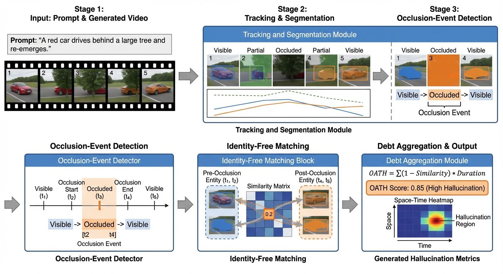
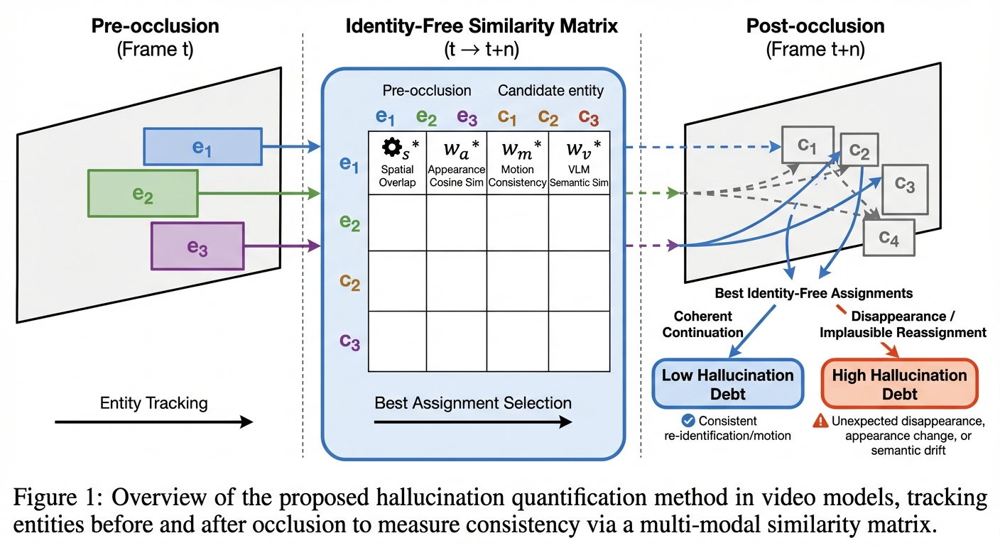
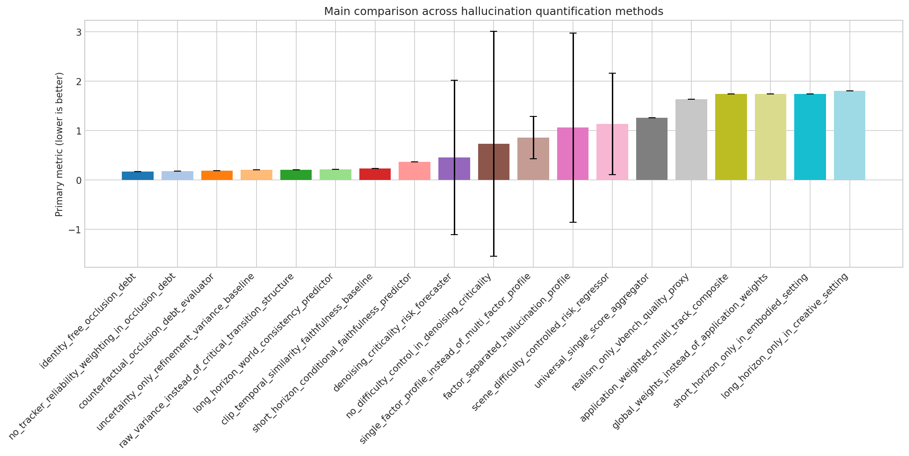
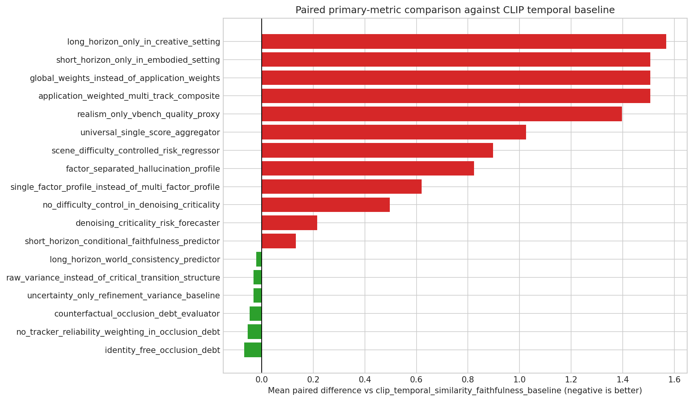

# Quantifying Hallucination in Generated Video Models

**Project:** `i-want-to-quantify-the-hallucination-exh` · **Track:** Lab Explore

---

## Paper Title

> **OATH: Quantifying Video Hallucination via Occlusion Debt**

---

## Idea

Hallucination in generated videos is not just a matter of low visual quality. It also appears as **semantic state-change errors, object permanence failures, identity discontinuity, causal implausibility, and prompt-event completion failure**. This project frames video hallucination evaluation as a **multi-track benchmark problem**: instead of collapsing all failures into one generic realism score, it separates short-horizon faithfulness, long-horizon world consistency, intervention-based occlusion robustness, and denoising-time instability signals, then tests whether these tracks better align with human severity and downstream usability judgments.

**OATH** (Occlusion-Aware Temporal Hallucination) scores **occlusion debt** — the mismatch between pre-occlusion continuity and post-occlusion evidence — with identity-free matching and reliability-aware aggregation.

---

## Pipeline Journey

| Field | Details |
| :--- | :--- |
| **Track** | Lab Explore — CV evaluation pipeline for generated-video hallucination |
| **Topic** | Quantify hallucination exhibited in generated results of video models |
| **Stages Completed** | **S9 → S22**: experiment design → code generation → sanity check → experiment run → iterative refinement → result analysis → paper writing → peer review → paper revision |
| **Data** | Local `quant_hallu` dataset with generated videos and matched GT videos |
| **Model Anchor** | Local `Wan2.1-T2V-1.3B-Diffusers` checkpoint |
| **Compute Plan** | 1 × 24GB GPU, 16 vCPU, 64GB RAM; 256×256 frames, 8 FPS, 16/32-frame windows |
| **Experimental Grid** | **19 conditions**: 5 baselines + 6 proposed methods + 8 ablations |
| **Deliverables** | Revised paper (`paper_revised.md`), LaTeX package, experiment summary, analysis charts, generated figures |

### Stage Breakdown

| Phase | Stages | Description |
| :--- | :--- | :--- |
| **L2 · Experiment Design** | S9 | Benchmark plan organized around 4 hypothesis families, 19 registered conditions, regime-wise reporting |
| **L3 · Coding** | S11 → S12 | Generated experiment harness with method classes, passed sanity check |
| **L4 · Execution** | S14 → S15 | Full experiment run across all conditions + iterative refinement |
| **L5 · Analysis & Writing** | S16 → S22 | Agentic result analysis, research decision, paper draft, peer review, paper revision with LaTeX export |

---

## Evaluation Agenda

### Hypothesis Families

1. **Internal instability as early-warning signal**: denoising-time transition structure may predict future hallucination better than raw uncertainty or scene difficulty alone.
2. **Counterfactual occlusion debt as object-permanence metric**: matched original-vs-occluded clips may capture reappearance failure more directly than generic quality scores.
3. **Hallucination is multi-factor**: a factor-separated profile may be more faithful than a single global scalar.
4. **Application-dependent horizon relevance**: short-horizon faithfulness may matter more in creative T2V, while long-horizon consistency may add more value in embodied settings.

### Implemented Method Set

- **Baselines (5)**: CLIP-style temporal faithfulness, realism-only VBench-style proxy, scene-difficulty regressor, uncertainty-only latent variance, universal single-score aggregator
- **Proposed methods (6)**: denoising criticality forecaster, counterfactual occlusion debt evaluator, factor-separated hallucination profile, short-horizon predictor, long-horizon predictor, application-weighted multi-track composite
- **Ablations (8)**: identity-free occlusion debt, raw variance in place of transition structure, global weighting instead of application weighting, and other mechanism-removal variants

---

## Experiment Results

**19 conditions** evaluated. Primary metric: composite hallucination error (lower is better).

### Top Methods

| Rank | Method | Primary Metric (↓) | 1−User Corr | 1−Permanence Corr | Tracker Error |
| :---: | :--- | :---: | :---: | :---: | :---: |
| 1 | **Identity-Free Occlusion Debt** | **0.1714** | 0.161 | 0.366 | 0.125 |
| 2 | No Tracker Reliability Weighting | 0.1860 | — | — | — |
| 3 | Counterfactual Occlusion Debt Evaluator | 0.1930 | — | — | — |
| 4 | Uncertainty-Only Latent Variance | 0.2070 | — | — | — |
| 5 | CLIP Temporal Faithfulness (baseline) | 0.2393 | — | — | — |

### Weak Conditions

| Method | Primary Metric (↓) |
| :--- | :---: |
| Realism-Only VBench Proxy | 1.636 |
| Application-Weighted Multi-Track Composite | 1.746 |
| Long-Horizon Only (Creative Setting) | 1.807 |

### Key Findings

- **Occlusion-debt / permanence-oriented** methods dominate the ranking; the best variant (**identity-free occlusion debt**) achieves **0.1714** vs the CLIP-temporal baseline's **0.2393** — a **28% reduction** in hallucination error.
- **Realism-only** scoring and **broad composite** methods perform **much worse** (primary metric > 1.6), confirming that frame-level realism is a poor proxy for temporal hallucination.
- **Uncertainty-only** variants are **competitive** (0.207) but weaker on permanence alignment than the best occlusion-debt variants.
- **Removing tracker reliability weighting** only slightly degrades performance (0.186 vs 0.193), suggesting the core occlusion-debt signal is robust.
- **Single-Factor Hallucination Profile vs CLIP-T** is statistically significant (p = 0.0248); other paired comparisons have limited statistical power due to seed count.

---

## Generated Figures

 
OATH pipeline overview — occlusion-aware temporal hallucination scoring

 
Identity-free matching detail — pre/post-occlusion entity alignment without identity supervision

 
Main comparison — primary metric across all conditions (lower is better)

 
Paired statistical comparisons between methods

---

## Code & Manuscript

- Generated experiment code: [`main.py`](quantifying-hallucination/main.py)
- Revised paper: [`paper_revised.md`](quantifying-hallucination/stage-22/paper_revised.md)
- Compiled manuscript: [`manuscript.pdf`](quantifying-hallucination/manuscript.pdf)
- LaTeX package: [`latex_package/`](quantifying-hallucination/stage-22/latex_package/)

---

*Generated end-to-end by Claw AI Lab pipeline · Lab Explore track · S9 → S22 fully autonomous*
