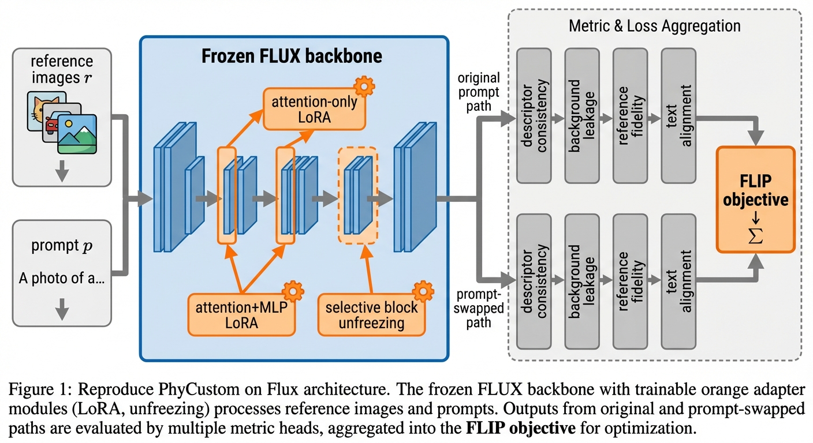
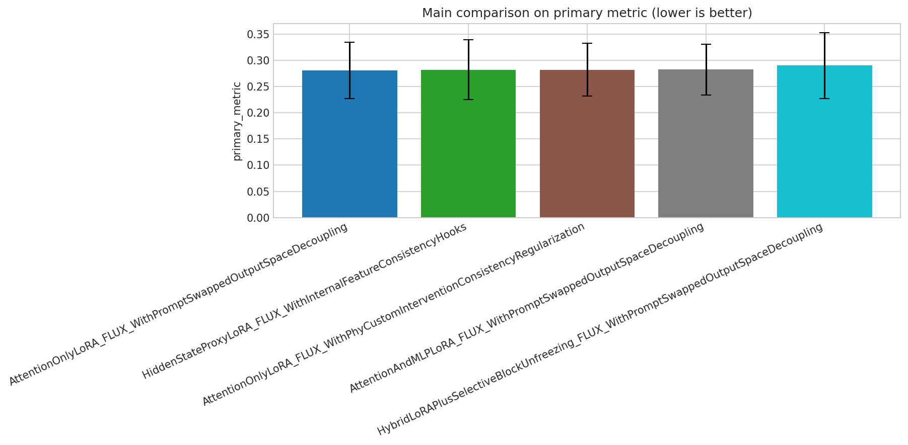
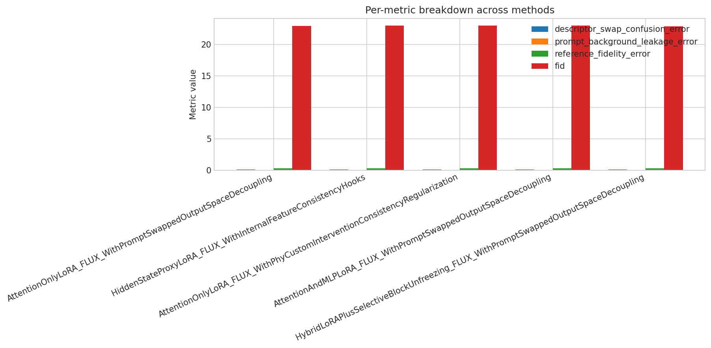

# Reproducing PhyCustom on FLUX

**Project:** `reproduce-phycustom-on-flux` · **Track:** Reproduce

---

## Paper Title

> **Reproducing PhyCustom on FLUX: An Empirical Reproduction Study**

---

## Idea

PhyCustom studies whether customized concepts can preserve **physical properties** under interventions such as viewpoint, lighting, context, and carrier-object changes. This project asks a stricter reproduction question: when the idea is ported to **FLUX**, do the claimed gains still hold under **intervention-based evaluation**, or do they disappear once we measure descriptor confusion, prompt-background leakage, and physical-transfer robustness rather than only generic realism? The generated code implements multiple FLUX-native adaptation variants, including attention-only LoRA, output-space prompt-swapped regularization, hidden-state proxy regularization, and hybrid LoRA plus selective block unfreezing.

---

## Pipeline Journey

| Field | Details |
| :--- | :--- |
| **Track** | Reproduce — PhyCustom-style regularization on FLUX |
| **Topic** | Reproduce PhyCustom on FLUX and test whether intervention-consistency gains survive the architecture transfer |
| **Anchor** | PhyCustom-style physical-property customization benchmark on the local `PhyDiff` dataset |
| **Stages Completed** | **S9 → S22**: experiment design → code generation → sanity check → experiment run → iterative refinement → result analysis → paper writing → peer review → paper revision |
| **Data** | Local `PhyDiff` dataset with `objects` and `verbs` concept families, prompt YAMLs, and concept images |
| **Model Anchor** | Local `FLUX.1-dev` checkpoint |
| **Compute Plan** | Single CUDA GPU, bf16, 512 resolution, 3 seeds per method |
| **Experimental Grid** | **5 methods** × **3 seeds** = **15 runs** |
| **Deliverables** | Revised paper (`paper_revised.md`), LaTeX package, experiment summary, analysis charts, generated figures |

### Stage Breakdown

| Phase | Stages | Description |
| :--- | :--- | :--- |
| **L2 · Experiment Design** | S9 | Reproduction plan built around H1-H3: PhyCustom regularization advantage, output-space vs hidden-state portability, and adaptation-capacity placement |
| **L3 · Coding** | S11 → S12 | Generated single-file FLUX experiment harness, passed sanity check |
| **L4 · Execution** | S14 → S15 | Full experiment run (15 runs) + iterative refinement |
| **L5 · Analysis & Writing** | S16 → S22 | Agentic result analysis, research decision, paper draft, peer review, paper revision with LaTeX export |

---

## Reproduction Agenda

### Main Hypotheses

1. **H1**: PhyCustom-style regularization should improve intervention consistency over plain LoRA and LoRA with prior preservation.
2. **H2**: Prompt/output-space decoupling should be a more portable FLUX-native bridge than hidden-state proxy regularization.
3. **H3**: Adaptation capacity and placement should matter: attention-only, MLP-inclusive, and hybrid unfreezing may separate prompt binding from deeper physical transfer.

### Implemented Methods

- **AttentionOnlyLoRA + PhyCustom Intervention Consistency** — attention-only LoRA with same-concept pull, different-concept margin, and leakage penalties
- **AttentionOnlyLoRA + Prompt-Swapped Output-Space Decoupling** — output-space regularization via prompt swapping
- **HiddenStateProxyLoRA + Internal Feature Consistency Hooks** — hidden-state-level regularization
- **AttentionAndMLPLoRA + Prompt-Swapped Decoupling** — expanded adaptation capacity (attention + MLP)
- **HybridLoRA + Selective Block Unfreezing + Prompt-Swapped Decoupling** — broadest adaptation with block-level unfreezing

---

## Experiment Results

**15 runs** across 5 methods, 3 seeds each. Primary metric: composite intervention error (lower is better).

| Method | Primary Metric (↓) | Descriptor Confusion | Prompt Leakage | Ref. Fidelity Error | FID |
| :--- | :---: | :---: | :---: | :---: | :---: |
| **Prompt-Swapped Decoupling (Attn-only)** | **0.2813** | 0.1091 | 0.0236 | 0.2976 | 22.94 |
| Hidden-State Proxy | 0.2815 | 0.1117 | 0.0235 | 0.2963 | 22.95 |
| PhyCustom Intervention Consistency | 0.2820 | 0.1097 | 0.0240 | 0.2992 | 22.96 |
| Attn+MLP Prompt-Swapped | 0.2815 | 0.1100 | 0.0237 | 0.2986 | 22.99 |
| Hybrid LoRA + Block Unfreezing | 0.2900 | 0.1147 | 0.0253 | 0.3054 | 22.85 |

### Key Findings

- All five regularization/placement variants perform **similarly** on the primary metric — the best-to-worst spread is only **~0.009**.
- **Output-space prompt-swapped decoupling** edges the aggregate mean, consistent with **H2**.
- **Hybrid selective unfreezing** is the weakest variant, suggesting that broader adaptation capacity introduces noise rather than capturing deeper physical transfer.
- **Paired t-tests** show most differences are **not statistically significant** at n=3 seeds (e.g., prompt-swap vs hidden-state proxy p ≈ 0.45).
- **Descriptor-swap confusion** and **prompt leakage** remain relatively low across all methods; **text-alignment error** stays high regardless of regularizer — pointing to a possible semantic alignment bottleneck in FLUX independent of the regularization strategy.

---

## Generated Figures

 
FLIP pipeline overview — FLUX-side LoRA attachment with intervention-based evaluation

 
Main comparison — primary metric across all 5 methods (3 seeds, error bars = std)

 
Per-metric breakdown across methods

---

## Code & Manuscript

- Generated experiment code: [`main.py`](reproduce-phycustom/main.py)
- Revised paper: [`paper_revised.md`](reproduce-phycustom/stage-22/paper_revised.md)
- Compiled manuscript: [`manuscript.pdf`](reproduce-phycustom/manuscript.pdf)
- LaTeX package: [`latex_package/`](reproduce-phycustom/stage-22/latex_package/)

---

**Reference:** Wu et al., *PhyCustom: Towards Realistic Physical Customization in Text-to-Image Generation*, arXiv [2512.02794](https://arxiv.org/abs/2512.02794), 2025.

---

*Generated end-to-end by Claw AI Lab pipeline · Reproduce track · S9 → S22 fully autonomous*
